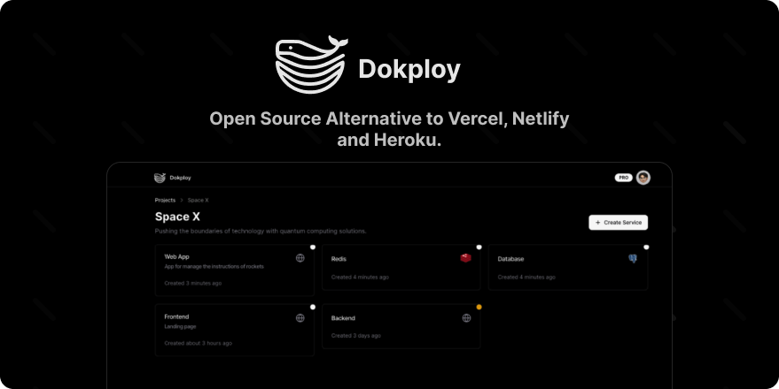

> **This is a modified fork of [Dokploy](https://github.com/Dokploy/dokploy), not affiliated with or
> endorsed by Dokploy Technology, Inc.**
>
> It carries only the Apache License 2.0 portion of upstream. Upstream's source-available
> `/proprietary` directories are not present; this fork supplies its own modules at those import
> paths. What that changes is described in [Differences from upstream](#differences-from-upstream).
>
> Upstream base commit and the sync procedure: [`UPSTREAM.md`](./UPSTREAM.md).

<div align="center">
  <a href="https://dokploy.com">
    
  </a>
  </br>
  </br>
  <p>Join us on Discord for help, feedback, and discussions!</p>
  <a href="https://discord.gg/2tBnJ3jDJc">
    
  </a>
</div>
<br />


Dokploy is a free, self-hostable Platform as a Service (PaaS) that simplifies the deployment and management of applications and databases.

## ✨ Features

Dokploy includes multiple features to make your life easier.

- **Applications**: Deploy any type of application (Node.js, PHP, Python, Go, Ruby, etc.).
- **Databases**: Create and manage databases with support for MySQL, PostgreSQL, MongoDB, MariaDB, libsql, and Redis.
- **Backups**: Automate backups for databases to an external storage destination.
- **Docker Compose**: Native support for Docker Compose to manage complex applications.
- **Multi Node**: Scale applications to multiple nodes using Docker Swarm to manage the cluster.
- **Templates**: Deploy open-source templates (Plausible, Pocketbase, Calcom, etc.) with a single click.
- **Traefik Integration**: Automatically integrates with Traefik for routing and load balancing.
- **Real-time Monitoring**: Monitor CPU, memory, storage, and network usage for every resource.
- **Docker Management**: Easily deploy and manage Docker containers.
- **CLI/API**: Manage your applications and databases using the command line or through the API.
- **Notifications**: Get notified when your deployments succeed or fail (via Slack, Discord, Telegram, Email, etc.).
- **Multi Server**: Deploy and manage your applications remotely to external servers.
- **Self-Hosted**: Self-host Dokploy on your VPS.

## Differences from upstream

Panel sign-in with **Google** and **GitHub** works here without a licence. It runs on better-auth's
own social providers, which upstream already configures in the Apache-licensed code; this fork adds
the buttons and lets them render on a self-hosted panel. Set the credentials as environment
variables:

```
GOOGLE_CLIENT_ID / GOOGLE_CLIENT_SECRET
GITHUB_CLIENT_ID / GITHUB_CLIENT_SECRET
```

The OAuth redirect URI is `https://<panel-domain>/api/auth/callback/google`. A button appears only
when its provider is configured. A Google identity links to an existing account with the same email
address; once an owner exists, creating a new account still requires an invitation.

**OIDC single sign-on** works too, against any standards-compliant provider. Register one under
**Settings -> SSO** as an owner or admin: provider ID, the email domain it serves, the issuer URL,
and a client ID and secret. Endpoints are read from the issuer's discovery document unless you give
an explicit discovery endpoint. Sign-in is then routed by email domain, so a user enters their work
address and lands at the right provider.

Register the redirect URI the settings page shows, which is
`https://<panel-domain>/api/auth/sso/callback/<provider-id>`.

Providers can only be added by an authenticated owner or admin. better-auth's own
`/sso/register` HTTP endpoint stays disabled, as upstream ships it.

**Audit logs** are recorded and viewable.

**Not implemented:** SAML, SCIM provisioning, custom roles, whitelabeling, and putting deployed
applications behind an auth gate. The panel says so where each would appear.

There is **no licence tier and no licence server**, so features whose logic lives in the
Apache-licensed code are simply available.

## 🚀 Getting Started

On a fresh Linux VM, as root:

```bash
curl -sSL https://raw.githubusercontent.com/akaike-byob/dokploy-oss/main/install.sh | bash
```

That installs Docker if missing, initializes a swarm, and brings up Traefik, Postgres and the panel
from `ujjwalakaike/dokploy-oss`. When it finishes, open `http://<server-ip>:3000` and create
the first account, which becomes the owner.

> Create the owner account immediately. Until one exists, whoever can reach the panel can register.

Requirements: a Linux host on amd64 or arm64, with ports 80, 443 and 3000 free.

The database password is generated per installation and kept in a Docker secret, so no two
installations share one. Postgres is never published outside the internal overlay network. An
installation that already has a Postgres service keeps it untouched, credentials included.

To upgrade, re-run the same command; it updates the service in place. To pin a version, set
`IMAGE=ujjwalakaike/dokploy-oss:<tag>`.

The panel's own "Update Available" button updates to **this** image, not upstream's. Point it
somewhere else with `PANEL_IMAGE`.

Note that upstream's own installer at `dokploy.com/install.sh` deploys upstream Dokploy, not this
fork. Upstream's documentation at [docs.dokploy.com](https://docs.dokploy.com) applies to everything
in the Apache-licensed core; ignore its enterprise sections.


[Github Sponsors](https://github.com/sponsors/Siumauricio)

### Contributors 🤝

<a href="https://github.com/dokploy/dokploy/graphs/contributors">
  
</a>

## 📺 Video Tutorial

<a href="https://youtu.be/mznYKPvhcfw">
  
</a>

## 🤝 Contributing

Check out the [Contributing Guide](CONTRIBUTING.md) for more information.
